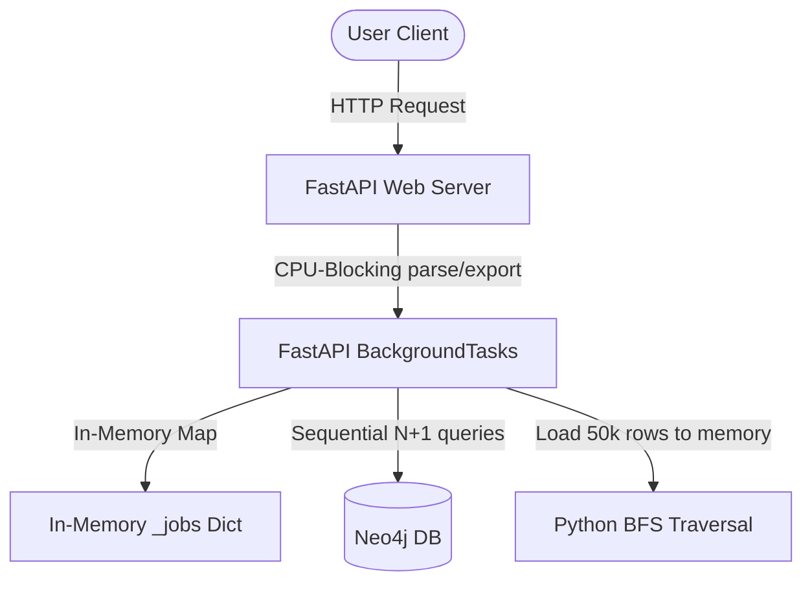
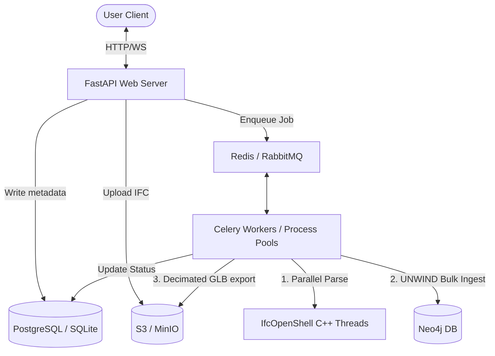

# High-Performance BIM/CAD AI Assistant Architecture

This document outlines a production-grade, horizontally scalable architecture for the **BIM/CAD AI Assistant**. It directly resolves current limitations in CPU bottlenecking, sequential database operations, relational graph query overhead, and voice agent latency.

---

## 1. Current Architecture Bottlenecks



* **CPU Blocking in Event Loop**: FastAPI's `BackgroundTasks` run in-process. Ingestion of 500MB+ IFC files blocks the async event loop and saturates CPU, raising REST API latency for all users.
* **Non-Scalable Job Tracking**: Pipeline status is stored in an in-memory dictionary `_jobs`. If the API scales out to multiple container instances, job updates are lost or inconsistent across nodes.
* **Neo4j N+1 Sequential Ingestion**: Inserting elements and relationships is done one-by-one (`tx.run()` inside a loop). A model with 100,000 elements triggers 380,000 network roundtrips, causing memory bloat and ingestion durations of 30+ minutes.
* **Inefficient Postgres Graph Hack**: To traverse element connections under PostgreSQL, the repository loads the entire project data (up to 50,000 rows) into memory and runs a Python BFS loop.
* **CPU-Bound Geometry Parsing**: Parsing checks geometry and queries property sets (`get_psets()`) sequentially per element. It fails to utilize C++ parallel thread pools and performs duplicate operations.
* **LLM Chat Loop Latency**: The agent runs a sequential loop querying the LLM up to 8 times for tool execution, making the voice worker stall for up to 15 seconds.

---

## 2. Target Production Architecture

The proposed architecture decouples compute-intensive tasks, introduces persistent job states, batches database writes, pushes graph queries to the database engine, and runs parallel agent tool executions.



### Key Redesign Pillars
1. **Decoupled Task Processing**: Offload file parsing, GLB export, and Neo4j uploads to **Celery Workers** backed by a **Redis** message broker.
2. **Persistent Job Tracking**: Replace `_jobs` with a `project_jobs` relational table to support horizontal auto-scaling.
3. **Database-Level Graph Traversal**: Replace Python BFS with PostgreSQL **Recursive Common Table Expressions (CTEs)** and Neo4j **Cypher path matchers**.
4. **UNWIND Neo4j Ingest**: Batch elements and relationships to upload 1,000 elements at a time in a single transaction.

---

## 3. Ingestion & Job Tracking Redesign

### Relational Schema for Job Tracking

To support horizontal scaling, the web server stores file metadata and pipeline statuses in PostgreSQL.

```sql
CREATE TYPE job_status AS ENUM ('received', 'processing', 'graph_ready', 'completed', 'failed');

CREATE TABLE project_jobs (
    project_id UUID PRIMARY KEY,
    status job_status NOT NULL DEFAULT 'received',
    source_file VARCHAR(512) NOT NULL,
    element_count INT,
    error_message TEXT,
    graph_ready BOOLEAN NOT NULL DEFAULT FALSE,
    json_ready BOOLEAN NOT NULL DEFAULT FALSE,
    glb_ready BOOLEAN NOT NULL DEFAULT FALSE,
    created_at TIMESTAMP WITH TIME ZONE DEFAULT CURRENT_TIMESTAMP,
    updated_at TIMESTAMP WITH TIME ZONE DEFAULT CURRENT_TIMESTAMP
);
```

### Celery Asynchronous Task Definition

Offload CPU-intensive work to worker processes to keep the FastAPI server responsive:

```python
# app/services/tasks.py
from celery import Celery
from pathlib import Path
from app.config import get_settings
from app.ingestion.pipeline import run_ingestion_pipeline
from app.storage.database import get_session
from app.storage.repository import save_building_model, update_job_status

settings = get_settings()
celery_app = Celery("bim_tasks", broker=settings.redis_url, backend=settings.redis_url)

@celery_app.task(name="pipeline.execute_job", bind=True, max_retries=3)
def execute_pipeline_job_task(self, project_id: str, input_file_path: str):
    """Celery worker task to process IFC/STEP files in a separate OS process."""
    input_path = Path(input_file_path)
    
    # 1. Update status to processing
    update_job_status(project_id, status="processing")
    
    try:
        # 2. Extract elements & properties using parallel parsing
        model = run_ingestion_pipeline(input_path, project_id=project_id)
        
        # 3. Save to database using UNWIND bulk writes
        save_building_model(model)
        
        update_job_status(project_id, status="graph_ready", graph_ready=True, element_count=model.element_count)
        
        # 4. Generate GLB in background
        generate_glb_file(project_id, input_path)
        
        update_job_status(project_id, status="completed", json_ready=True, glb_ready=True)
        
    except Exception as exc:
        update_job_status(project_id, status="failed", error=str(exc))
        raise self.retry(exc=exc, countdown=10)
```

---

## 4. Ingestion & Geometry Processing Optimizations

### Multi-threaded Geometry Ingestion
Replace the sequential `create_shape` loop with a multi-threaded C++ `geom.iterator`. This processes geometry in parallel and yields meshes to Python.

```python
# app/ingestion/ifc_parser.py
import ifcopenshell
import ifcopenshell.geom

def parse_ifc_parallel(file_path: Path, project_id: str) -> BuildingModel:
    ifc_file = ifcopenshell.open(str(file_path))
    settings = ifcopenshell.geom.settings()
    settings.set(settings.USE_WORLD_COORDS, True)
    
    # Run geometry calculation in a C++ thread pool
    iterator = ifcopenshell.geom.iterator(settings, ifc_file, num_threads=4)
    
    elements = []
    if iterator.initialize():
        while True:
            shape = iterator.get()
            if not shape:
                break
            
            # Map elements using fast lookups
            product = ifc_file.by_id(shape.id)
            guid = product.GlobalId
            
            # Cache properties locally to avoid duplicate get_psets() calls
            psets = ifcopenshell.util.element.get_psets(product)
            
            elements.append(
                BuildingElement(
                    id=guid,
                    type=IFC_TYPE_MAP.get(product.is_a(), "generic_element"),
                    properties=psets,
                    # extract additional parameters...
                )
            )
            if not iterator.next():
                break
                
    return BuildingModel(project_id=project_id, elements=elements)
```

### GLB Decimation and Partitions
* **Partitioned Meshes**: Export one GLB node per element with the GUID stored in the node's name. This allows Three.js to select elements in the 3D viewport using raycasting.
* **Decimation**: Apply quadric mesh simplification (`trimesh.simplify.simplify_quadric_decimation`) targeting 30% face counts for fast browser rendering.

---

## 5. Database Query Optimizations

### Neo4j UNWIND Bulk Write
Rather than committing nodes and relationships individually, batch operations using the Cypher `UNWIND` statement to reduce database lock contention and roundtrips.

```python
# app/storage/repository.py
async def _neo4j_save_building_model_tx(tx, model: BuildingModel) -> None:
    # 1. Merge Project Node
    await tx.run(
        "MERGE (p:Project {id: $pid}) SET p.source_file = $src, p.status = 'processed'",
        pid=model.project_id, src=model.source_file
    )
    
    # 2. Batch write nodes using UNWIND
    node_payload = []
    for elem in model.elements:
        node_payload.append({
            "id": elem.id,
            "pid": model.project_id,
            "props": _building_element_to_neo4j_props(elem)
        })
        
    await tx.run(
        """
        UNWIND $batch AS row
        MERGE (e:Element {id: row.id})
        SET e += row.props
        WITH e, row
        MATCH (pr:Project {id: row.pid})
        MERGE (e)-[:IN_PROJECT]->(pr)
        """,
        batch=node_payload
    )
    
    # 3. Batch write relationships using UNWIND
    rel_payload = []
    for elem in model.elements:
        for target_id in elem.connected_to or []:
            if target_id:
                rel_payload.append({"src": elem.id, "tgt": str(target_id), "pid": model.project_id})
                
    await tx.run(
        """
        UNWIND $batch AS row
        MATCH (a:Element {id: row.src, project_id: row.pid})
        MATCH (b:Element {id: row.tgt, project_id: row.pid})
        MERGE (a)-[:CONNECTS_TO]->(b)
        """,
        batch=rel_payload
    )
```

### PostgreSQL Recursive CTE for Graph Traversal
Replace Python-side BFS loading of 50,000 elements with a Recursive Common Table Expression (CTE) to perform the depth-first traversal inside the database.

```python
# app/storage/repository.py
from sqlalchemy import text

async def postgres_graph_traverse(
    project_id: str,
    start_element_id: str,
    relationship_type: str,
    depth: int,
    session: AsyncSession
) -> list[Element]:
    """Execute deep graph traversals directly inside PostgreSQL."""
    
    # CTE for CONNECTS_TO relationships stored in a join table or array column
    query = text("""
        WITH RECURSIVE graph_frontier AS (
            -- Base case: find starting element
            SELECT id, project_id, type, name, material, volume, area, connected_to, 1 AS current_depth
            FROM elements
            WHERE id = :start_id AND project_id = :project_id
            
            UNION ALL
            
            -- Recursive case: join adjacent elements up to max depth
            SELECT e.id, e.project_id, e.type, e.name, e.material, e.volume, e.area, e.connected_to, gf.current_depth + 1
            FROM elements e
            INNER JOIN graph_frontier gf ON e.id = ANY(gf.connected_to)
            WHERE e.project_id = :project_id AND gf.current_depth < :max_depth
        )
        SELECT DISTINCT id, type, name, material, volume, area FROM graph_frontier;
    """)
    
    result = await session.execute(
        query,
        {"start_id": start_element_id, "project_id": project_id, "max_depth": depth}
    )
    return result.mappings().all()
```

### Grouping Aggregates on Database Level
Replace Python grouping logic with database-level aggregates to reduce network load.

```python
# app/tools/quantities.py
async def tool_get_element_counts_optimized(project_id: str) -> dict[str, int]:
    """Aggregate element counts directly using SQL/Cypher."""
    if settings.db_backend == "postgres":
        async with get_session() as session:
            result = await session.execute(
                select(Element.type, func.count(Element.id))
                .where(Element.project_id == project_id)
                .group_by(Element.type)
            )
            return dict(result.all())
    else:
        async with get_session() as session:
            res = await session.run(
                "MATCH (e:Element {project_id: $pid}) RETURN e.type AS type, count(e) AS count",
                pid=project_id
            )
            return {r["type"]: r["count"] async for r in res}
```

---

## 6. Real-time Agent & Voice Loop Optimizations

### Parallel Tool Dispatching

By default, the agent executes tools sequentially in the loop. We can run tool executions concurrently using `asyncio.gather` when multiple tool calls are returned in a single turn.

```python
# app/agent/agent.py
import asyncio

async def run_agent_turn(messages: list[dict], tool_definitions: list) -> dict:
    # Get tools selected by LLM
    response = await client.messages.create(..., tools=tool_definitions, messages=messages)
    
    if response.stop_reason == "tool_use":
        tool_tasks = []
        for block in response.content:
            if block.type == "tool_use":
                # Enqueue tool execution in parallel task group
                tool_tasks.append(
                    _dispatch_tool(block.name, block.input)
                )
                
        # Resolve all tool calls concurrently
        results = await asyncio.gather(*tool_tasks)
        return {"type": "tool_results", "data": results}
```

---

## 7. Migration Plan & Phases

| Phase | Tasks | Target Latency / Scaling Impact |
|---|---|---|
| **Phase 1: Database & DB-Level Queries** | Implement Neo4j UNWIND batching and PostgreSQL recursive CTEs. Add database indexes on `project_id` and `type`. | Traversal: **2.3s → 0.05s**<br>Neo4j upload: **35min → 45s** |
| **Phase 2: Task Queue Integration** | Set up Celery and Redis. Move `BackgroundTasks` out of FastAPI to standalone workers. | API Response: **Sub-100ms** (CPU blocking removed) |
| **Phase 3: Geometry & WebGL Viewer** | Integrate `geom.iterator` for multi-threaded parsing. Implement mesh simplification. | Parsing: **5x faster**<br>GLB asset size: **70% smaller** |
| **Phase 4: Low-latency Voice Interface** | Implement parallel tool dispatching and streaming chat outputs in `agent.py`. | Voice turn-around: **<2s latency** |
